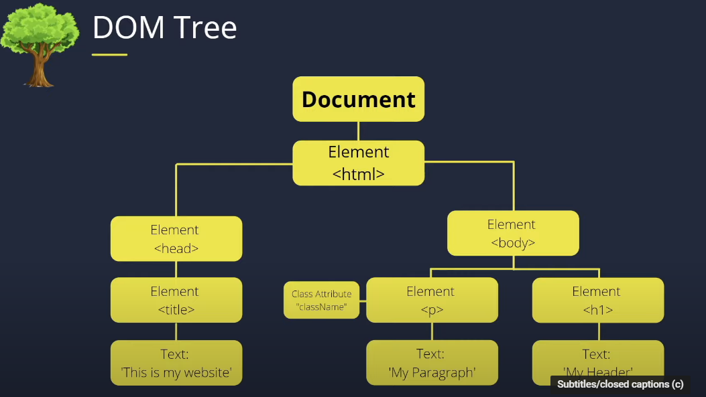
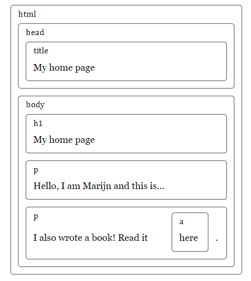

## Some short notes on Dom Manipulation

> It stands for DOCUMENT OBJECT MODEL 



```html
<!doctype html>
<html>
  <head>
    <title>My home page</title>
  </head>
  <body>
    <h1>My home page</h1>
    <p>Hello, I am Marijn and this is my home page.</p>
    <p>I also wrote a book! Read it
      <a href="http://eloquentjavascript.net">here</a>.</p>
  </body>
</html>

```

* This code has following structure



>document.documentElement  serves as the root of the dom tree 
>The firstChild and lastChild properties point to the first and last child elements or have the value null for nodes without children

