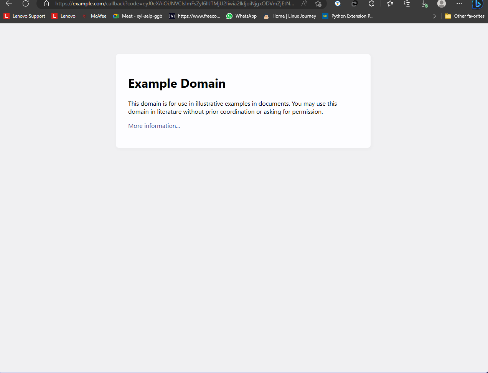
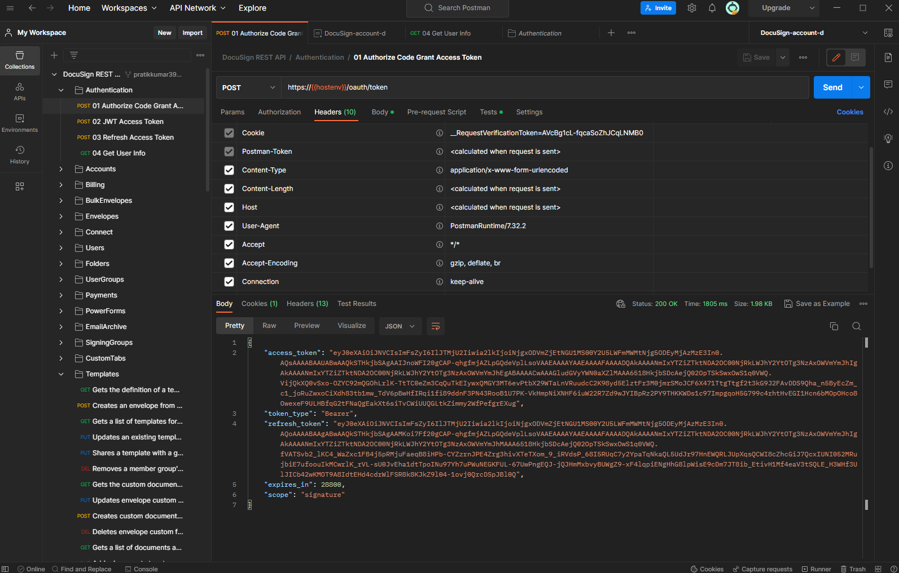
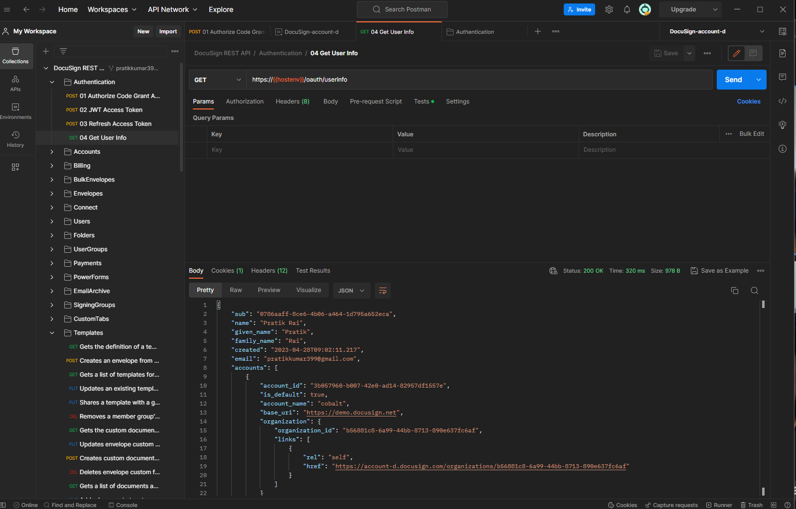
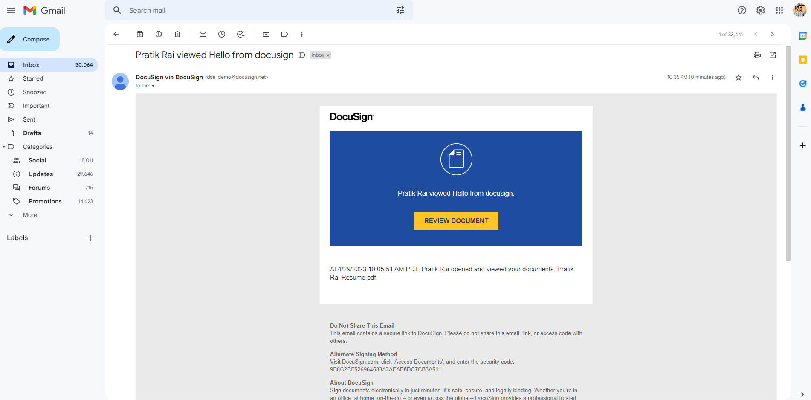
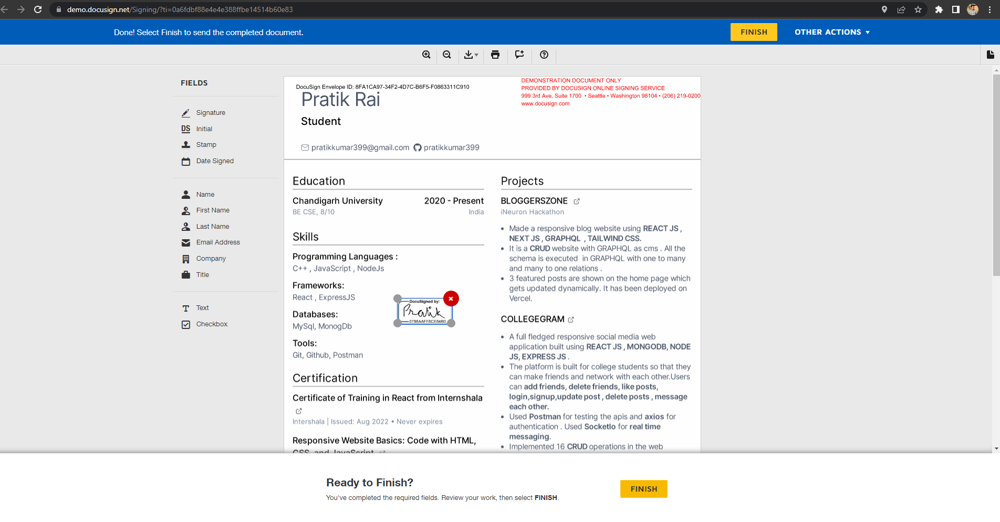
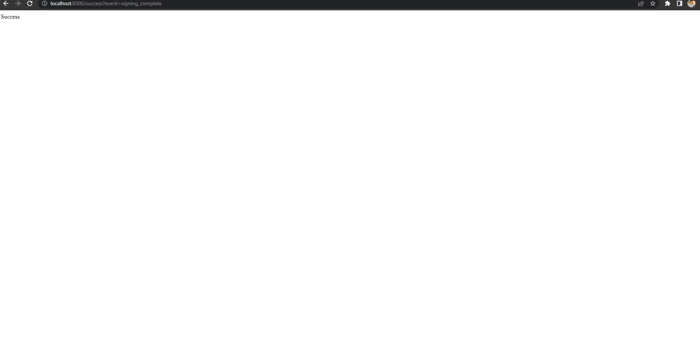
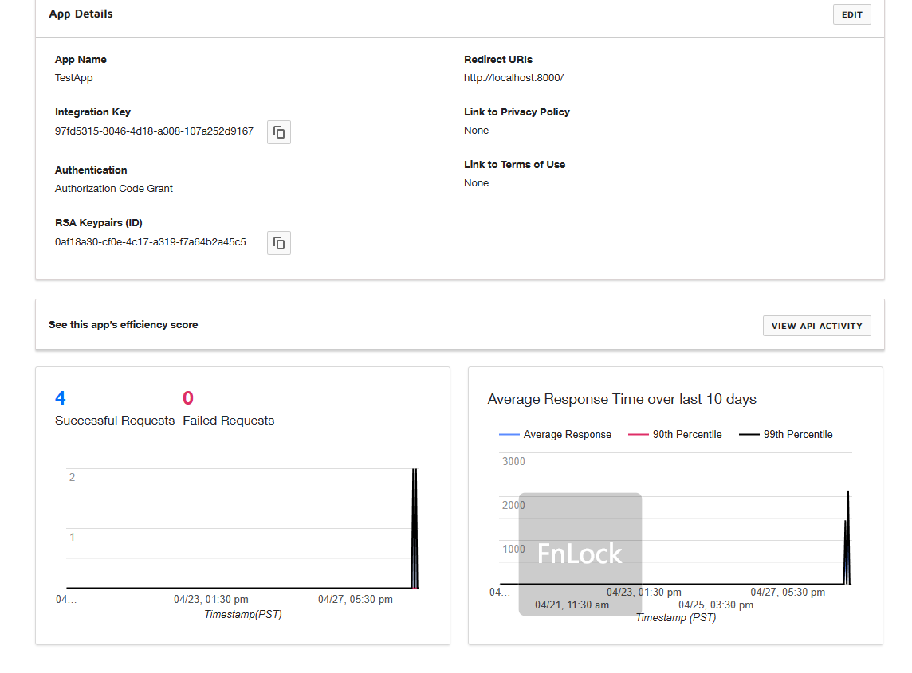
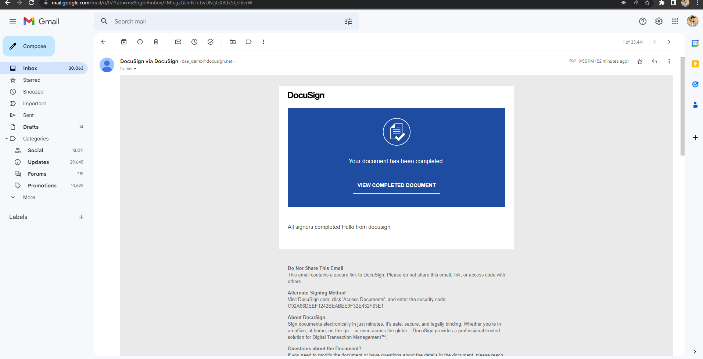
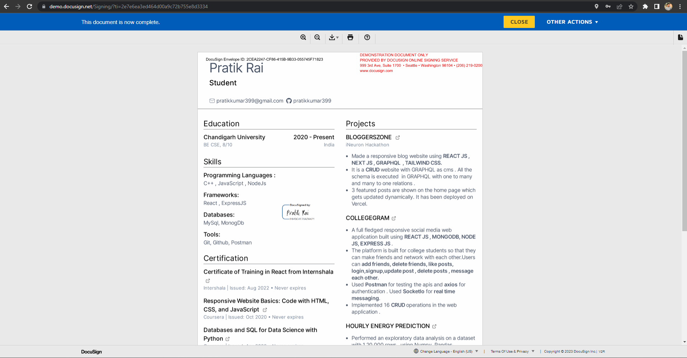

# DocuSign Signature Request
This is a simple Node.js web application that demonstrates how to use the DocuSign eSignature API to request signatures from users.

## Steps required in creating the application: 

### Step 1: Create an OAuth 2.0 Integration Key in DocuSign
To use OAuth with DocuSign, you need to create an Integration Key in your DocuSign account. Follow these steps:

* Log in to your DocuSign account.
* Go to the "Admin" tab and select "Integrations".
* Click on the "Add Integration Key" button.
* Enter a name for the integration key, and select "Authorization Code Grant" as the grant type.
* Enter the redirect URI where the user will be redirected after granting access. This can be any valid URL in your application.
* Add any necessary scopes for your integration key.
Click "Save".

### Step 2: Get Authorization Code
To get the authorization code, you will need to redirect the user to the DocuSign authorization URL, where they will need to log in and grant your application access to their account.

### Step 3: Exchange Authorization Code for Access Token
Once you have the authorization code, you can exchange it for an access token by making a POST request to the DocuSign token endpoint

### Step 4: Use the Access Token to Make API Requests
With the access token, you can make API requests to DocuSign on behalf of the user. Here are the API requests you can use to perform the actions you mentioned:

## Installation
* Clone this repository to your local machine.
* Install the necessary dependencies by running npm install.
* Create a .env file in the root directory of the project and fill in the following variables:
  * BASE_PATH: The base URL for the DocuSign API endpoint (e.g. https://demo.docusign.net/restapi).
  * INTEGRATION_KEY: The integration key for your DocuSign account.
  * USER_ID: Your DocuSign user ID.
  * TEMPLATE_ID: The ID of the DocuSign template you want to use for signature requests.
  * CLIENT_USER_ID: A unique identifier for the signer that you want to use for embedded signing.
  * PORT: The port number to run the server on (optional; default is 8000).
* Start the application by running npm start.
## Usage
* Once the application is running, visit http://localhost:8000 in a web browser.
* Fill out the form with your name, email address, and company name
* Click the "Sign" button to initiate the signature request.
* You will be redirected to the DocuSign signing ceremony.
* Sign the document as instructed.
* Once you have successfully signed the document, you will be redirected to the /success page.

## Screenshots to show the working of the application

> Getting the access token

> verifying that the access token is valid

> getting user info from the access token

> Sending the template envolpe to the user mail id fir signature

> the document for signature

>After signing the document a success page is visible 

> the api dashboard for the app we are using for development

>mail showing that the document has been signed

> the signed document
